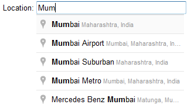

```ngMeta
name: Part II Google’s Api
completionMethod: peer
```

# Part II Google’s Api

- Aapne notice kiya hoga ki jab aap google par kuch **search** karte hai to wo khud aapka **sentence pura** kar deta hai. Iss feature ko hum **autocomplete** bolte hai.

- Ab hum apni app mei yeh feature daalenge jisse hum kissi bhi place ka naam likhe to google usse complete kar de. Aur firr uss place ki latitude aur longitude value nikal kar weather information bhi nikal le.




# Google’s Api Continued

- Jaise openWeatherMap ki Api use karne ke liye aapko **Api Key** ki jarurat thi, theek ussi tarah google ki Api use karne ke liye aapko Api Key chahiye.

- [Iss](https://developers.google.com/maps/documentation/javascript/places-autocomplete) link par jao aur firr yeh steps karo.
	- **Get A Key** par click karo.
	- **Create a new project** par click karo.
	- **Create and Enable API** par click karo.
- Ab aapko Api key mil jayegi, key ko copy kar lo.

- Kyunki hum **autocomplete search box** use karna chahte hai. Aapko google ki places library apni html file mein include karni hogi. Uske liye yeh code likho.

```javascript
<script 
	type="text/javascript"
	src="https://maps.googleapis.com/maps/api/js?key=apni_api_key&libraries=places">
</script>
```
-  Angular mei google ka autocomplete feature use karne ke liye hum [vsGoogleAutocomplete](https://github.com/vskosp/vsGoogleAutocomplete#getting-started) module ka use karenge.

## Issue

- **Ab** [yeh](https://github.com/vidur149/angular-weather/issues/2) **Issue resolve karna start kar do.** 

- **Reference Links**
    - Places Autocomplete Docs, [en](https://developers.google.com/maps/documentation/javascript/places-autocomplete), hi
	- Google Api Console, [en](https://console.developers.google.com/projectselector/apis/dashboard), hi
	- VsGoogleAutoComplete, [en](https://github.com/vskosp/vsGoogleAutocomplete#getting-started), hi