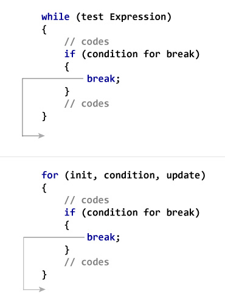

```ngMeta
name: Using Breaks
completionMethod: manual
```


Agar aap yeh diagram dekhoge toh aap samjhoge, ki `break` command se hum jiss bhi loop ke andar aapne woh command likhi hai, uss loop se immediately bahar nikal jaate hai.

Ab iss idea ko use karte hue in example codes ka `dry run` karein.

```python
for val in "string":
    if val == "i":
        break
    print(val)

print("The end")
```

```python
var = 10
while var > 0:              
   print 'Current variable value :', var
   var = var - 1
   if var == 5:
      break

print "Good bye!"
```

```python
num = 407

i = 2
prime = True
first_divisor = -1
while (i<num):
    if (num%i == 0):
        prime = False
        first_divisor = i
        break
    i += 1

print prime
if not prime:
    print first_divisor
```

### Jab `nested loops` hote hai, toh `break` command se hum uss loop se bahar aate hai, jo immediately pehla loop hota hai jiske `andar` break likha hota hai.

Jaise neeche diye hue program mei `break` statement sirf loop2 se bahar nikalega.

```python
for i in range(5): #loop1
    for j in range(10): #loop2
        if (j > 3): 
            break 
        else:
            print "*", 
    print ''
```
Iss program ka `output` likh kar, iss program ko bina `break` statement ke likhiye.
Apne likhe hue naye program ka bhi `dry run` karein.

```python
for a in range(6):
    for b in range(6):
        if (a == b):
            break
        print '*',
    print ''
```
Iss program ka `output` likh kar, iss program ko bina `break` statement ke likhiye.
Apne likhe hue naye program ka bhi `dry run` karein.