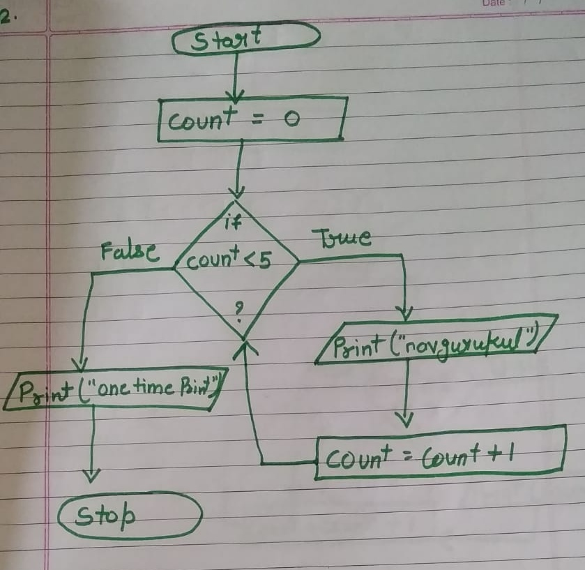

```ngMeta
name: Loop
submission_type: url
```

# What are loops?

Agar humein koi bhi kaam baar baar karna ho toh computers humein bahot asani se uss kam ko karne mein help karte hain.

Jaise agar mujhe apne 100 friends ko ek eMail bhej ke kisi event ke baare mein batana ho toh main ek ek kar ke har kisi ko eMail bhejne mein bore ho jaungi. Yeh karte karte mujhe bahot mushkil bhi hogi. Aur galti karne ka dar bhi hai. Loops ka istemaal karke same type ka kaam hum baar baar karva sakte hain computers se.


# Writing code for loops

```python
counter = 0
while counter < 5:
	print "NavGurukul"
	counter = counter + 1
```

Iss code mein:

1. `counter` naam ka ek variable define ho raha hai jiski value `0` hai. Flowchart mein bhi same cheez ho rahi hai.
2. Fir ek `while` loop likha hai jiske aage ek condition hai `counter < 5`. `While` ka matlab ho jab tak (जब तक). Toh ek tareeke se `while` loop python ko bolta hai ki jab tak aage di hui condition `True` hai tab tak loop chalao.
3. Jaise hi loop khatam hoga toh while ke bahar wala code chalega. Yeh samajhne ke liye neeche diye hua code chalao:

```python
counter = 0 
while counter < 5:
	print "NavGurukul"
	counter = counter + 1
print "one time print"
```


Yeh code chala ke dekhoge toh `"NavGurukul"` 5 baar print hoga aur last waali line sirf ek baar.

# Ek aur example

Maan lo humne code likhna hai jisme humne 1 se 100 tak saare number print karne hai jo 2 se divide hote hain. Toh hum while loops ka use kar ke aise likhenge:


```python
counter = 1
while counter < 100:
	if counter % 2 == 0:
		print counter
	counter = counter + 1
```

**Note: Yahan humne counter 1 se isliye shuru kiya hai kyunki humne 1 se 100 tak print karne hai aur na ki 0 se 99 tak.**

Iss video mein hum ache se loops ke baare mein samjhenge aur code likhna seekhenge.

<!-- @[youtube](loops-video-id-here) -->

<!-- ## Structure of the Video -->
1. Loops help us do the same things again and again. Same work can be done again and again.

2. Take an example of getting laptops from a car to the house. If there are 50 laptops in the car.

3. Explain this from the concept of Jab tak. Jab tak (ghar mein laptops 0 nahi ho jaate) {tab tak laptops lao aur gaadi mein rakho.}
      - Kaam baar baar karna hai.
      - But kitni baar karna hai? Woh jab tak se decide hota hai.
      - Jab tak mein jo condition daalte hain tab tak kaam hota hai.
      - Yahan jab tak mein hum laptops laptops >= 10 likhenge.
      - Matlab jab laptops 10 ya 10 se zyada hain tab jab tak ke andar wala kaam karna band kar do.
      - Jab tak ke andar wala kya kaam hai. Andar wala kaam hai laptop lana ghar se aur laptop ko gaadi mein rakh dena.
      - Jaisa hi aisa hota ek laptop kam ho jayega.
      - Hum isi ki python mein likhna seekhenge.
4. Take the example of teaching this in python.
      - Let's say total laptops are 10. Laptops = 0. Yeh maintain karega abhi gaadi mein kitne laptops hain.
      - Jab tak laptops 10 nahi ho jaate. Tab tak laptops laao aur gaadi mein rakho.
      - Matalb `while laptops >= 10`. This will make sure this work happens for for 10 times.
      - Kya kaam karna hai? Laptops gaadi mein rakhna. Print karo "Ek laptop gaadi mein rakh diya"
      - Fir kaise track rakhenge ki laptop rakh dia. Aur ek baar kaam kar lia hai.
      - Uske liye hum laptop wale variable mein +1 kar denge. Matlab utne laptops humne gaadi mein rakh die hain.
      - Let's do the dry run of the same program to see if this works fine.
5. Second we will write the same program in the python visualiser to see if it works the same way as we thought it would. And now explain how the visualiser would run this code.
6. Similarly take another example of printing numbers from 1 to 20.
7. Take another example on how printing the even numbers from 20 to 40.
8. In the 20 to 40 example talk about where to add the if statements. Adding the if statement outside and adding the if statement inside. (This also needs to be shown on how writing if statements inside and outside will create a difference.). i+1 and % should be used.
9. Take the same example to print the even numbers between 20 to 40. But here do i+2 to do it.
